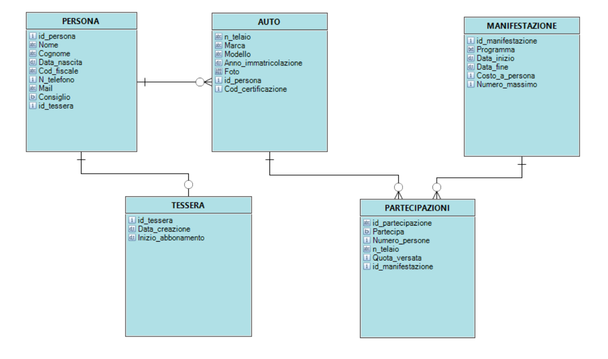

# Vecchie Glorie 2021
Applicazione creata per aiutare con la gestione di un club di auto d'epoca e dei suoi raduni.

L'upload dei file è programmato per funzionare su AWS, ho tolto le credenziali e sostituito le chiamate al metodo con un link fisso per evitar problemi, quindi se scoppia qualcosa probabilmente è per quello.

Credenziali di amministrazione: admin:admin

# Progettazione funzionale
-	L'amministratore potrà iscrivere nuovi soci al club, tesserarli, modificarne i dati e rinnovare le suddette tessere.
-	L'amministratore potrà aggiungere e modificare le auto dei soci, con possibilità di caricane immagini.
-	L'amministratore potrà creare raduni ed eventi tramite un'interfaccia a calendario.
-	L'amministratore potrà segnare le partecipazioni ai suddetti eventi, tenendo traccia delle conferme e dei pagamenti.
-	L'amministratore potrà tener traccia delle persone esterne che partecipano agli eventi iscrivendole come visitatori e, in caso, tesserandoli per farli diventare membri ufficiali.

# Progettazione tecnica

-	Backend in Java, tramite il framework SpringBoot.
-	Frontend in Typescript, tramite il framework Angular.
-	Database relazionale MySql, dockerizzato.
